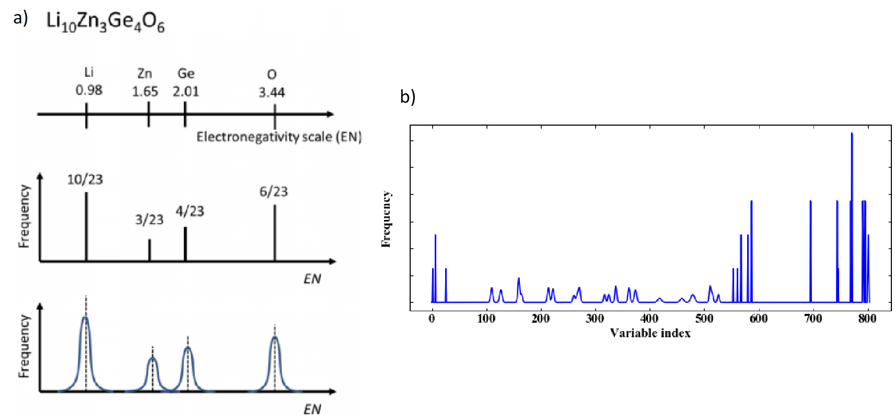

# chemhist — Chemical Formula to Histogram Descriptor

A Python package for generating histogram-based compositional descriptors from chemical formulas (chemhist descriptors).

Developed by **Tsubasa Koyama** and **Masanobu Nakayama**  
_Nagoya Institute of Technology, Chamical Battery Laboratory_

## 1. Overview

`chemhist` converts chemical compositions into histogram-type vector descriptors based on elemental properties (atomic number, electronegativity, etc.).  
These descriptors are designed for use in machine learning analyses for materials (Materials Informatics).

## 2. Description

### 2.1 Standard Chemhist descriptors
To handle the chemical compositions of materials (mainly inorganic solid compounds) in data science,
it is convenient to represent them as descriptors, which are one-dimensional numerical vectors.
This script converts chemical compositions into histogram descriptors by transforming the elemental properties
that constitute the composition—such as atomic number, electronegativity, and ionic radius—into histograms.
Figure 1 illustrates the generation process of a histogram descriptor using electronegativity (EN)
for the chemical formula Li₁₀Zn₃Ge₄O₆ as an example.


**Figure 1** a) Histogram descriptor for electronegativity.  b) Histogram for all elemental properties. <BR><BR>

The number line shown in Figure 1(a) represents electronegativity.
By dividing the number line into appropriate intervals (bins) and counting the number of elements within each bin, a frequency distribution is obtained.
This frequency is then normalized by the total number of atoms (i.e., converted into atomic fractions so that the total equals 1).
The resulting normalized histogram is used to construct a general vector-type descriptor.

However, since machine learning models cannot directly learn the adjacency relationships between these discrete intervals,
an appropriate Gaussian function is applied to smooth the histogram,
and the resulting data are output as a vector.

Table 1 lists the elemental properties and their abbreviations that can be converted into histogram descriptors using this script.
Figure 1(b) illustrates an example in which the properties listed in Table 1 are converted into histogram descriptors
and the resulting vectors are visualized as graphs.<BR>>

**Table 1** Elemental properties used for chemhist descriptors

| Property                     | Abbreviation | Description / Related Quantity     |
|------------------------------|---------------|------------------------------------|
| Electronegativity            | EN            | —                                  |
| Atomic Number                | AN            | —                                  |
| Mendeleev Number             | MN            | —                                  |
| Atomic Weight                | AW            | —                                  |
| Melting Point                | MP            | —                                  |
| Covalent Radius              | CoR           | —                                  |
| Atomic Radius                | AR            | —                                  |
| Ionic Radius                 | IR            | —                                  |
| Crystal Radius               | CrR           | —                                  |
| Group Number                 | PG            | —                                  |
| Period Number                | PN            | —                                  |
| s, p, d, f block elements      | SPDF          | SPDF_0, _1, _2, _3  correspond to concentrations of s-, p-, d-, f- block elements                                  |


### 2.2 Algebric Descriptors
The **algebric descriptor** represents the interaction between different **element pairs** in a chemical composition.  
For each unique element pair (A–B), the difference or product of a selected elemental property  
(such as atomic number, electronegativity, atomic radius, etc.) is calculated.  
The resulting value is plotted on the **x-axis**, while the **pair concentration (x₁ + x₂)**,  
defined as the sum of the atomic fractions of the two elements, is plotted on the **y-axis** to form a histogram.

Unlike simple averaging methods, this descriptor captures the **relative relationships between elements**,  
quantifying how dissimilar or cooperative element pairs are within a composition.  
A Gaussian broadening can be applied to produce a continuous, smooth distribution.

**Calculation Procedure**

1. Enumerate all unique element pairs (A–B) in the composition.  
2. For each pair, compute either:  
   - Difference: ΔP = |P₁ − P₂|  
   - Product: P₁ × P₂  
   where *P* represents a chosen elemental property (e.g., electronegativity EN).  
3. Compute the atomic fraction of each element (x₁, x₂),  
   and define the **pair concentration** as (x₁ + x₂).  
4. Construct a histogram using ΔP (or the product) as the x-axis  
   and the pair concentration (x₁ + x₂) as the y-axis.

**Example: Electronegativity Difference (ΔEN) Descriptor for Li₀.₅Mn₁.₀O₂.₀**

| Element Pair | EN₁ | EN₂ | ΔEN | Atomic Fraction x₁ | Atomic Fraction x₂ | Pair Concentration (x₁ + x₂) |
|---------------|------|------|------|--------------------|--------------------|-------------------------------|
| Li–Mn | 0.98 | 1.55 | 0.57 | 0.5/3.5 = 0.1429 | 1.0/3.5 = 0.2857 | 0.4286 |
| Li–O  | 0.98 | 3.44 | 2.46 | 0.5/3.5 = 0.1429 | 2.0/3.5 = 0.5714 | 0.7143 |
| Mn–O  | 1.55 | 3.44 | 1.89 | 1.0/3.5 = 0.2857 | 2.0/3.5 = 0.5714 | 0.8571 |

By plotting ΔEN on the x-axis and the pair concentration on the y-axis,  
we can observe that Li–O and Mn–O pairs dominate the overall distribution.  
The spread and peak positions of ΔEN reflect the diversity of bonding character—  
for instance, larger ΔEN values indicate more ionic bonding tendencies.

**Features**

- Represents **element-pair-level interactions** via property differences or products.  
- Captures **chemical heterogeneity** and **bonding diversity** beyond simple mean descriptors.  
- Enables comparison of inter-element relationships without requiring crystal structure information.  
- Gaussian broadening provides smooth and continuous histogram distributions.


### 2.3 Matrix Descriptors

The **matrix descriptor** represents pairwise relationships between elements  
based on categorical elemental properties such as:

- **PN**: principal quantum number  
- **PG**: group number in the periodic table  
- **SPDF**: valence block type (s=1, p=2, d=3, f=4)

For each property, a square matrix is constructed where the rows and columns correspond  
to the property indices (for example, 1–4 for the SPDF block type).  
Each matrix element `(i, j)` stores the **sum of atomic fractions** `(x₁ + x₂)`  
for all element pairs whose properties correspond to categories `i` and `j`.

Importantly, **the diagonal elements are included**.  
Diagonal terms `(i, i)` represent pairs of *different* elements belonging to the **same block**,  
such as Ni–Mn in the d-block or O–F in the p-block.

After the matrix is constructed, the **upper-triangular part (including the diagonal)**  
is flattened row by row into a one-dimensional vector.  
This flattened vector becomes the **matrix descriptor**.


**Example: SPDF Matrix Descriptor**

Consider the composition **Li₁.₀Ni₀.₅Mn₀.₅O₂.₀**.

Each element belongs to one of four valence blocks (SPDF):

| Element | spdf | Atomic fraction (x) |
|----------|-------|--------------------|
| Li | 1 | 1.0 / 4.0 = 0.25 |
| Ni | 3 | 0.5 / 4.0 = 0.125 |
| Mn | 3 | 0.5 / 4.0 = 0.125 |
| O  | 2 | 2.0 / 4.0 = 0.50 |

All unique unordered element pairs are formed, and the **sum of their atomic fractions** `(x₁ + x₂)` is calculated:

| Element pair | spdf₁ | spdf₂ | x₁ + x₂ |
|---------------|--------|--------|----------|
| Li–O  | 1 | 2 | 0.75 |
| Li–Ni | 1 | 3 | 0.375 |
| Li–Mn | 1 | 3 | 0.375 |
| Ni–Mn | 3 | 3 | 0.25 |
| Ni–O  | 3 | 2 | 0.625 |
| Mn–O  | 3 | 2 | 0.625 |

Next, we construct a 4×4 SPDF matrix where each entry `(i, j)` corresponds to the spdf combination of two elements.  
The sum of the corresponding atomic fractions is accumulated in that position.

| spdf₁ \ spdf₂ | 1 | 2 | 3 | 4 |
|---------------|---|---|---|---|
| **1 (s)** | 0.000 | 0.750 | 0.750 | 0.000 |
| **2 (p)** | 0.750 | 0.000 | 1.250 | 0.000 |
| **3 (d)** | 0.750 | 1.250 | 0.250 | 0.000 |
| **4 (f)** | 0.000 | 0.000 | 0.000 | 0.000 |

The diagonal component `(3,3)` represents the Ni–Mn pair —  
different elements, but both in the same d-block.

Finally, the upper triangular portion (including the diagonal) is flattened  
from left to right and top to bottom to produce a one-dimensional vector:

[0.000, 0.750, 0.750, 0.000, 0.000, 1.250, 0.000, 0.250, 0.000, 0.000]

This vector is the **SPDF matrix descriptor** for the composition Li₁.₀Ni₀.₅Mn₀.₅O₂.₀.


## 3. Installation

`chemhist` can be installed locally from source using `pip`.  Download source files to your local computer, such as by `git clone`.
Make sure you are in the directory that contains the `pyproject.toml` file.

```bash
cd path/to/chemhist_project
pip install .
```

If you encounter any build errors (for example, *access denied* or *failed to build wheel*),  
clean up previous build directories and try again:

```bash
# Windows PowerShell
Remove-Item -Recurse -Force build, dist, chemhist.egg-info
```

To verify that the installation was successful:

```python
import chemhist
print(chemhist.__file__)
```

If the package is installed correctly, the path to  
`site-packages/chemhist/__init__.py` will be displayed.


## 4 Usage


### 4.1. Import and generate descriptors
The main function is `get_descriptor()`, which converts a chemical formula into a histogram-based descriptor vector.

```python
from chemhist import get_descriptor

# Example: create histogram descriptor for Li0.5Mn1.0O2
vec, labels = get_descriptor("Li0.5Mn1.0O2")

print("Number of features:", len(vec))
print("First 10 features:", vec[:10])
```

This returns:
- `vec` : a NumPy 1D array containing the descriptor values (broadened histogram)
- `labels` : a list of feature names corresponding to each elemental property of `vec`


### 4.2. CLI execution (optional)
After installation, you can also run chemhist directly from the command line:

```bash
python -m chemhist LiCoO2 LiMnO2 --out descriptors.csv
```

This command will:
- Convert the listed chemical formulas into histogram descriptors
- Save the results into a CSV file (`descriptors.csv` by default)
- Include the feature names in the header

### 4.3 Notes
- The broadening is applied by a Gaussian smoothing function to make the histogram continuous.  
- All descriptors are normalized by the total number of atoms in the formula.  
- Missing data in elemental properties are handled automatically.  
- The output vector can be directly used as input features for ML models (e.g., regression, classification).


## 5. Licensing and citation  (License, Citing)
**License(About License)**　This software is released under the MIT License, see the LICENSE.

**Citation(Citing)**  R. Jalem, M. Nakayama, Y. Noda, T. Le, I. Takeuchi, Y. Tateyama, H. Yamasaki, "A general representation scheme for crystalline solids based on Voronoi-tessellation real feature values and atomic property data", Sci. Technol. Adv. Mater., 19, 231-242 (2018) [DOI: 10.1080/14686996.2018.1439253](https://doi.org/10.1080/14686996.2018.1439253)

## Funding
Kakenhi 19H05815, 20H02436, Japan
